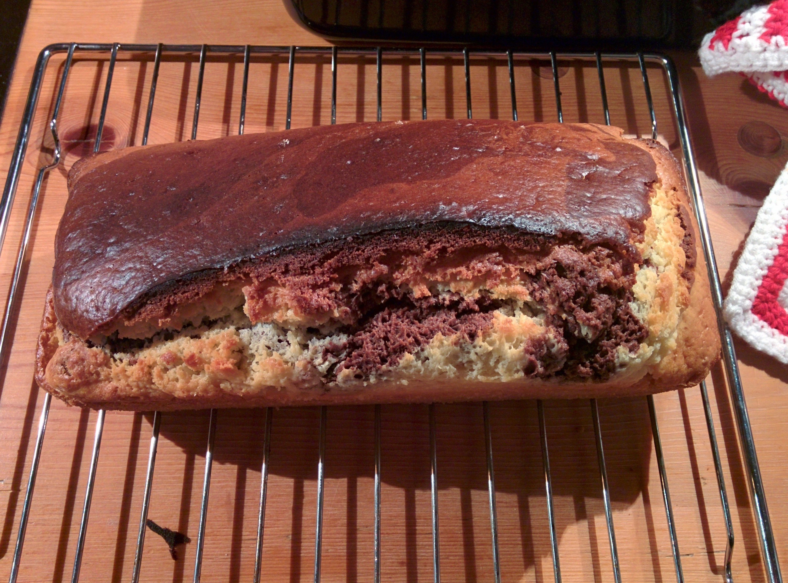

Mein Rezept für einen kleinen aber feinen Mamorkuchen:
 
 * 280g Mehl (Eigentlich Weizenmehl, aber Dinkel geht auch gut und ist meine Wahl)
 * 1 Päckchen Backpulver
 * 2 Eier
 * 250ml Milch
 * 80g Butter
 * 140g Zucker

Die Zubereitung dann so:

 * Die Butter in einem kleinen Topf bei niedrigster Stufe zerlaufen lassen.
 * Während die Butter zerläuft kann man Mehl und Backpuler mit einem [Zerstäuber](http://www.amazon.de/gp/product/B000X2ZROE/ref=as_li_tl?ie=UTF8&camp=1638&creative=6742&creativeASIN=B000X2ZROE&linkCode=as2&tag=httpsdatenknm-21) zerstäuben.
 * Dann den Zucker noch unter das Mehl heben.
 * Die flüssige Butter in ein anderes Behältniss tun und Milch und Eier dazugeben.
 * Dann mit einem Handmixer das Milch-Eier-Butter-Gemisch in die andere Schüssel einarbeiten.
 * Wenn der Teig ordentlich durchgerührt ist, zwackt man etwas von dem Teig ab und rührt Kakao unter bis der Teig die gewünschte Farbe hat. Wenn der Teig in dem Prozess zu fest wird, kann man noch etwas Milch nachgiesen.
 * Dann den Ofen auf 180°C vorwärmen. 
 * Jetzt eine Kastenform nehmen, mit Butter einreiben und dann noch Mehl in die Form geben so das das Mehl an der Butter kleben bleibt.
 * Zuerst gibt man den hellen Teig in die Form und danach verteilt man den dunklen Teig in der Mitte längs des hellen Teigs.
 * Zum schluss kann man mit einem Löffel den hellen und dunklen Teig verwibeln, je nachdem wie es gewünscht ist.
 * Der Kuchen braucht etwa 45 Minuten zum Backen. 
 * Nach 10 Minuten kann man den Kuchen nochmal raus holen um in der Mitte nochmal aufzuschneiden, damit er die bekannte Form bekommt.
 * Ich empfehle nach 30 Minuten alle fünf Minuten nach dem Kuchen zu sehen und wenn er einen guten Eindruck macht mit einer langen Zahnstocher in den Kuchen reinzustechen, wenn an dem Holzwerkzeug kein Teig mehr kleben bleibt ist der Kuchen fertig.
 * Wenn der Kuchen fertig ist lässt man ihn für 10 Minuten abkühlen.
 * Dann schneidet man am besten mit einem Messer den Kuchen vom Rand der Form ab und kipt die Form und lässt den Kuchen auf einen Backofenrost fallen. Das sorgt dafür das der Kuchen beim Abkühlen gut austrocknen kann und nicht so matschig ist.
 
Der fertige Mamorkuchen sieht dann so aus:

