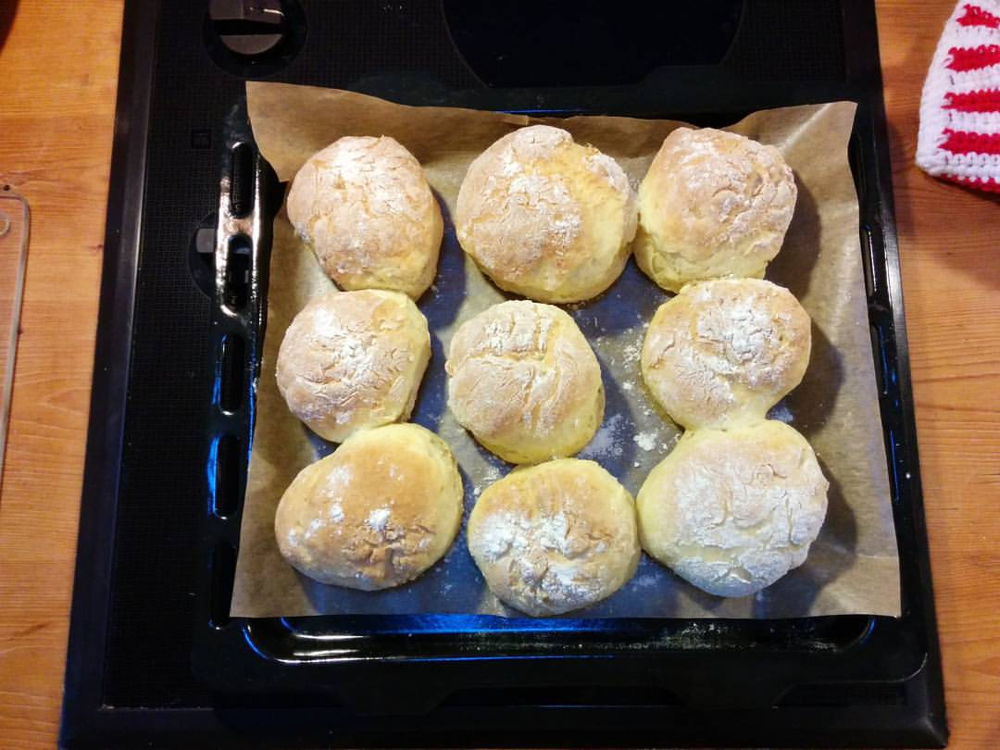

Wer auf die schnelle ein paar Brötchen backen will, dem kann ich folgendes Rezept empfehlen:
 
 * 250g Quark
 * 270g Mehl (Ich nehm meistens Dinkel, aber Roggenmehl geht auch gut, hier kann man gut und gerne Experimentieren)
 * 1 Päkchen Backpulver
 * 2 Eier
 * 1 Prise Salz

Die Zubereitung dann so:

 * Alle Zutaten in eine Schüssel. Mehl und Backpulver am besten mit einem [Zerstäuber](http://www.amazon.de/gp/product/B000X2ZROE/ref=as_li_tl?ie=UTF8&camp=1638&creative=6742&creativeASIN=B000X2ZROE&linkCode=as2&tag=httpsdatenknm-21) zerstäubern damits nicht Klumpt.
 * Mitels Handmixer mit Knethaken alles vermengen.
 * Eine seperate Schüssel mit Mehl bereitstellen.
 * Backblech mit Backpapier bereitstellen.
 * Den Backofen auf 180°C vorwärmen
 * Die Hände leicht anfeuchten.
 * Ein Stück Teig herrausnehmen und zu einer Kugel formen.
 * Kugel im Mehl rollen und aufs Backblech legen
 * Die letzten 3 Schritte so oft wiederholen, bis der Teig komplett verarbeitet wurde.
 * Das Blech in den Ofen schieben.
 * Die Brötchen brauchen etwa 30 Minuten bis sie fertig sind. Am besten alle 10 Minuten nachsehen wie weit sie gediegen sind.
 
Die fertigen Brötchen sehen bei mir dann so aus:

